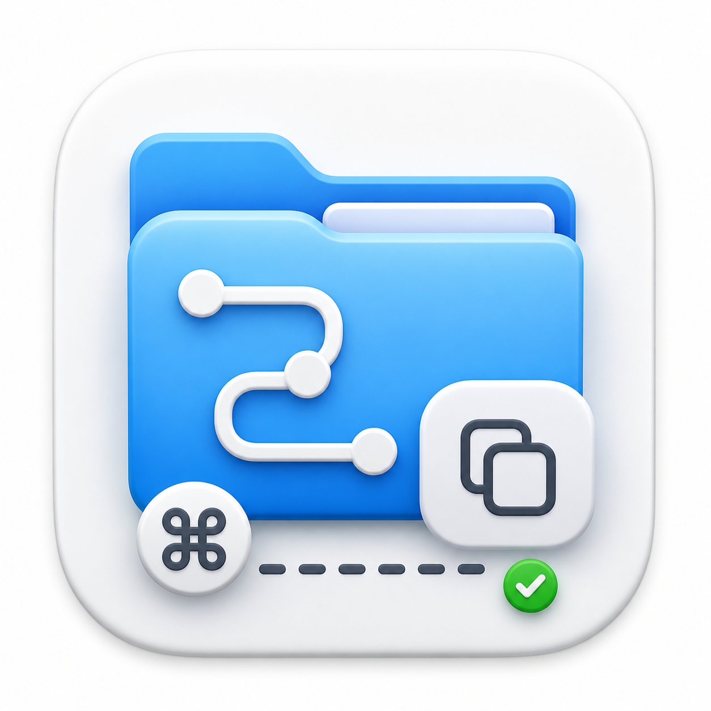

# PathCopy

<p align="center">
  
</p>

<p align="center">
  macOS Finder 右键菜单增强：一键复制文件或文件夹的完整路径。
</p>

## 为什么做这个

AI 时代，一个很常见但烦人的动作变多了：

你需要把本机某个文件、目录、工程、截图、日志、配置文件的完整路径复制出来，然后粘贴给 ChatGPT、Claude、Cursor、Codex 或其他 AI 工具，让它们继续分析、读取或处理。

macOS 自带路径复制能力，但藏得比较深：选中文件后按住 `Option`，右键菜单才会出现“拷贝 ... 为路径名称”，快捷键是 `⌥⌘C`。

PathCopy 做的事情很小：把“复制完整路径”固定放进 Finder 普通右键菜单里。

## 功能

- 在 Finder 右键菜单中添加“复制完整路径”
- 支持文件和文件夹
- 支持多选，多条路径按行复制
- 不需要主 App 常驻后台
- 使用 macOS 原生 Finder Sync Extension

## 安装

### 下载二进制包

从 [Releases](https://github.com/let5sne/pathcopy/releases) 下载 `PathCopy.zip`，解压后把 `PathCopy.app` 拖到 `/Applications`，打开一次并启用 Finder 扩展。

早期 Release 包目前是 ad-hoc signed，未做 Apple notarization。如果 macOS 阻止打开，可以右键点击 `PathCopy.app` 后选择“打开”，或按下面的源码方式本机构建。

### 从源码构建

先克隆仓库：

```bash
git clone https://github.com/let5sne/pathcopy.git
cd pathcopy
```

构建并安装到 `/Applications`：

```bash
./scripts/build.sh
./scripts/install.sh
open /Applications/PathCopy.app
```

如果右键菜单没有立刻出现，打开 PathCopy，点击“打开扩展设置”，确认 `PathCopy Finder Extension` 已启用，然后重启 Finder：

```bash
killall Finder
```

## 使用

1. 在 Finder 中选中文件或文件夹
2. 右键
3. 点击“复制完整路径”
4. 粘贴到 AI 工具、终端、文档或 issue 中

多选时会复制成多行：

```text
/Users/you/project/README.md
/Users/you/project/Sources
/Users/you/Desktop/debug.log
```

## 构建要求

- macOS
- Xcode
- XcodeGen：`brew install xcodegen`

项目包含 `FinderPathCopy.xcodeproj`，也可以直接用 Xcode 打开构建。脚本方式会用 `project.yml` 重新生成 Xcode 工程。

## 发布二进制包

推送 tag 会触发 GitHub Actions 自动构建 Release：

```bash
git tag v0.1.0
git push origin v0.1.0
```

CI 会产出：

- `PathCopy.zip`
- `PathCopy.zip.sha256`

本地也可以手动打包：

```bash
./scripts/build.sh
./scripts/package.sh
```

## 原理

PathCopy 由两部分组成：

- `PathCopy.app`：设置入口，用来打开 Finder 扩展管理界面
- `PathCopyFinderExtension.appex`：真正运行在 Finder 里的右键菜单扩展

主 App 不需要一直启动。只要 Finder 扩展启用，右键菜单就由系统加载。

## 许可

MIT
